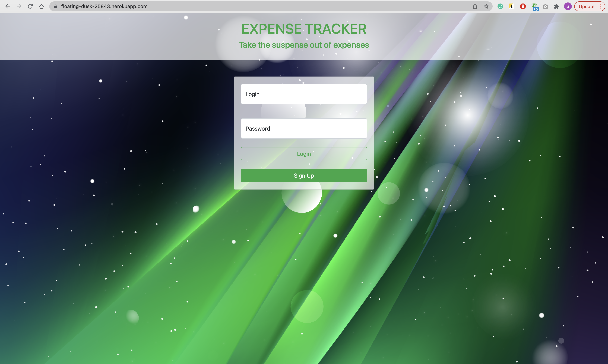

# expense-tracker

## Table of Contents    
* [User Story](#user-story)
* [Description](#description)
* [Built with](#built-with)
* [Installations](#installations)
* [Contribution](#contribution)
* [Screenshots](#screenshots)

## User Story
- GIVEN I need to better save for retirement, trips, big purchases.

- WHEN I add a tag
- THEN I can type a name of the tag I want to add
- THEN I can pick a specific color for that tag to be shown on the pie chart.

- WHEN I add an expense, my monthly income is automatically deducted.
- THEN I am presented with an updated pie chart that shows all my expenses.  

- WHEN I click on the edit button
- THEN I am presented with a form to edit an expense.

- WHEN I sign out
- THEN I am able to sign in with my credentials and my data is saved. 

## Description
* This is a web application that allows users to track their expenses and income.
* The user can create a new account, sign in, and sign out.
* The user can add an expense, edit an expense, delete an expense, and view a pie chart of their expenses.
* The user can add a tag, edit a tag, and delete a tag.
* The user can view their expenses and income in a pie chart.
* The user can view their expenses and income in a bar chart.
* After signing out, the user's data is saved.

## Built with
* Node.js
* Express.js
* MySQL
* Handlebars

## Installations
* bcrypt
* chart.js
* connect-session-sequelize
* dotenv
* express
* express-handlebars
* express-session
* handlebars
* mysql2
* sequelize

Development dependencies:
* nodemon

## Contribution
Made with ❤ by Anthony Barragan [@Abarragan89](https://github.com/Abarragan89), Tigran Balayan [@TigranBalayan10](https://github.com/TigranBalayan10), and Shahen Tokhalyan [@Tokhalyan](https://github.com/Tokhalyan)

## Screenshots

